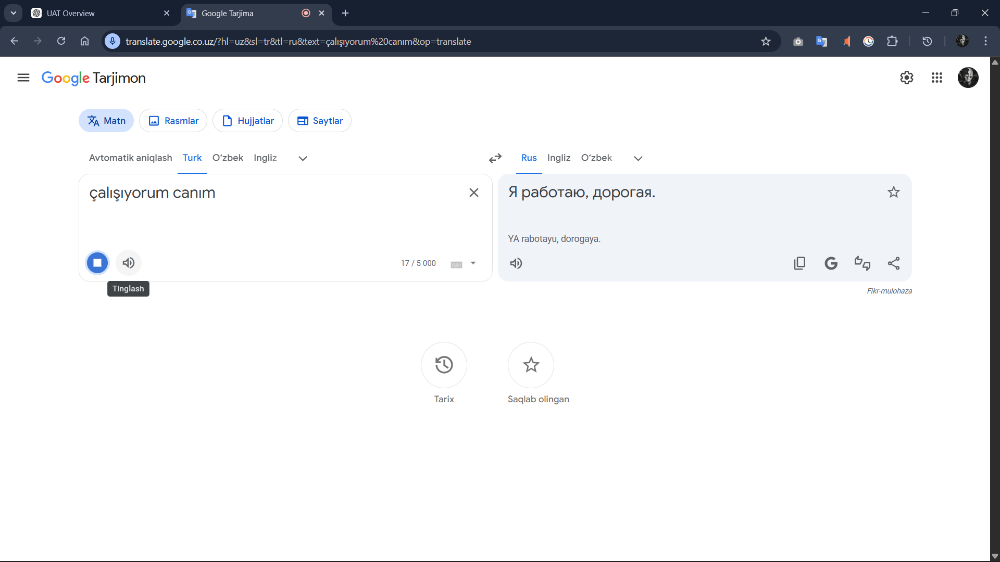

# Bug Report: Google Translate

**Title:** Language switching is confusing  

**ID:** BUG_01  

**Scenario:** Language Switching

**Steps to Reproduce:**  
1. Open the translation app  
2. Select a language to change from the right dropdown  
3. Select a language to change to  

**Expected Result:**  
- The chosen language should be replaced correctly in its position  
- Other languages should remain unaffected  

**Actual Result:**  
- The language moves to the right incorrectly  
- Another language that wasn’t selected disappears from the right  
- The new language appears in the wrong position  

**Attachment:**  
- ./bug1.mp4

---

**Title:** Mute / Unmute functionality missing 

**ID:** BUG_02   

**Scenario:** Mute / Unmute  

**Steps to Reproduce:**  
1. Open the translation app  
2. Press the "mic" icon to start voice input  
3. Press the "mic" icon to stop voice input  
4. Press the "mic" icon again to continue  

**Expected Result:**  
- After pressing the "mic" icon, a mute/unmute button should appear  

**Actual Result:**  
- No mute/unmute button appears; user cannot pause or resume listening  

**Attachment:**  
